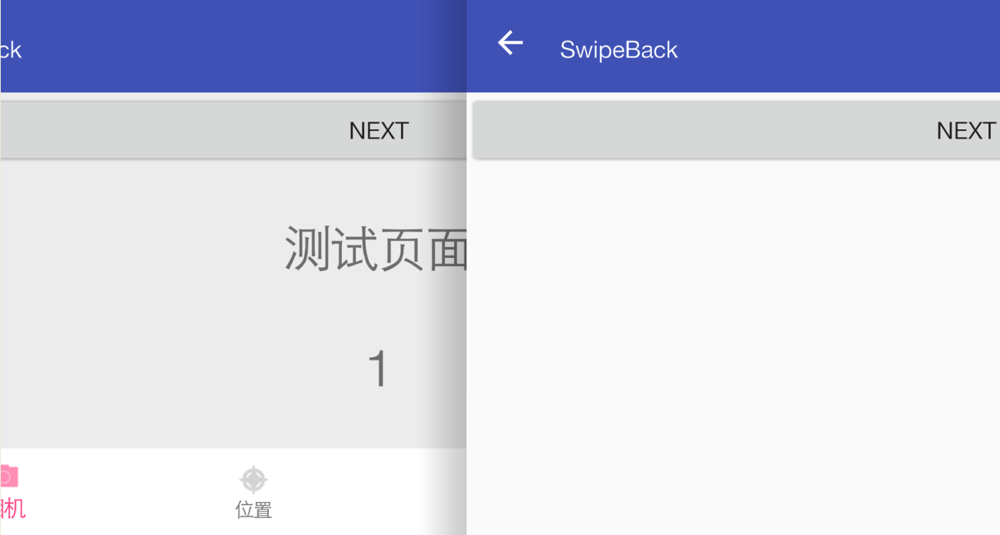

# SwipeBack	[  ](https://bintray.com/tyzlmjj/maven/swipe-back/_latestVersion)


这个库我借鉴了[SwipeBackLayout](https://github.com/ikew0ng/SwipeBackLayout),加入了背景Activity的视差联动的效果，专注于实现左侧边缘滑动返回的效果，并且尽量减少了对项目的侵入性。

需要注意的是，在5.0及以上实现的效果较为完美，5.0以下还是略微有美中不足之处,主要原因是调用了隐藏的API，在5.0以下罢工！我能想到的解决方案大概就是在代码中控制所有的进出动画，但是这样就会对项目代码造成很大的侵入性，所以暂时5.0上下的效果略有不同。

##实现效果图




##引入库

for Gradle:
```
compile 'me.majiajie:swipe-back:1.0.0-alpha2'
```

and for Maven:
```
<dependency>
  <groupId>me.majiajie</groupId>
  <artifactId>swipe-back</artifactId>
  <version>1.0.0-alpha2</version>
  <type>pom</type>
</dependency>
```

##使用

使用只需三个步骤

### 1.修改Activity继承

让activity继承SwipeBackActivity。SwipeBackActivity是继承AppCompatActivity的
```
public class BaseActivity extends SwipeBackActivity
```
### 2.在Application中添加代码

```
public class MyApplication extends Application
{
    @Override
    public void onCreate()
    {
        super.onCreate();
        this.registerActivityLifecycleCallbacks(ActivityStack.getInstance());
    }
}
```


### 3.修改主题样式

这里修改主题样式在5.0上下是有所不同

values-v21/styles.xml
```
<style name="AppTheme" parent="...">
	<!--侧滑滑动-在API21以上的(不是必要的，你可以自定义，但是推荐这个动画)-->
	<item name="android:windowAnimationStyle">@style/Animation.Activity.Style</item>
</style>
```

5.0(API21)以下的styles.xml
```
<style name="AppTheme" parent="...">

	<!--侧滑滑动-在API21以下必要的-->
	<item name="android:windowIsTranslucent">true</item>
	<item name="android:windowAnimationStyle">@android:style/Animation.Translucent</item>

</style>
```

